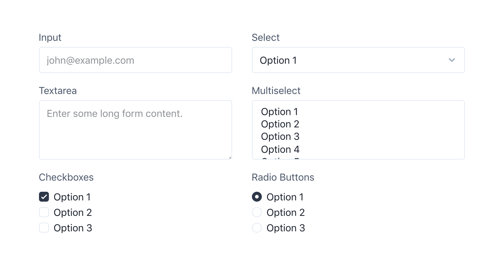

# Tailwind CSS Custom Forms

Out of the box, selects, checkboxes, and radios look awful in Tailwind and the only way to make them look better is with custom CSS.

The goal of this project is to provide a better starting point for form elements that is still fairly unopinionated, and easy to customize by adding utilities instead of having to write complicated CSS rules.

[Demo](https://tailwindcss-custom-forms.netlify.com/)



## Install

1. Install the plugin:

  ```bash
  # Using npm
  npm install @tailwindcss/custom-forms

  # Using Yarn
  yarn add @tailwindcss/custom-forms
  ```

2. Add it to your `tailwind.config.js` file:

  ```js
  // tailwind.config.js
  module.exports = {
    // ...
    plugins: [
      require('@tailwindcss/custom-forms')
    ]
  }
  ```

## Documentation

The project is still early but basic documentation can be found here:

[Read the documentation](https://tailwindcss-custom-forms.netlify.com/)

## Local development

1. Clone the repository:

    ```bash
    git clone https://github.com/tailwindcss/custom-forms.git tailwindcss-custom-forms

    cd tailwindcss-custom-forms
    ```

2. Install the dependencies:

    ```bash
    # Using npm
    npm install

    # Using Yarn
    yarn
    ```

3. Start the development server:

    ```bash
    # Using npm
    npm run dev

    # Using Yarn
    yarn run dev
    ```

    Now you should be able to see the demo/docs running at localhost:3000.
